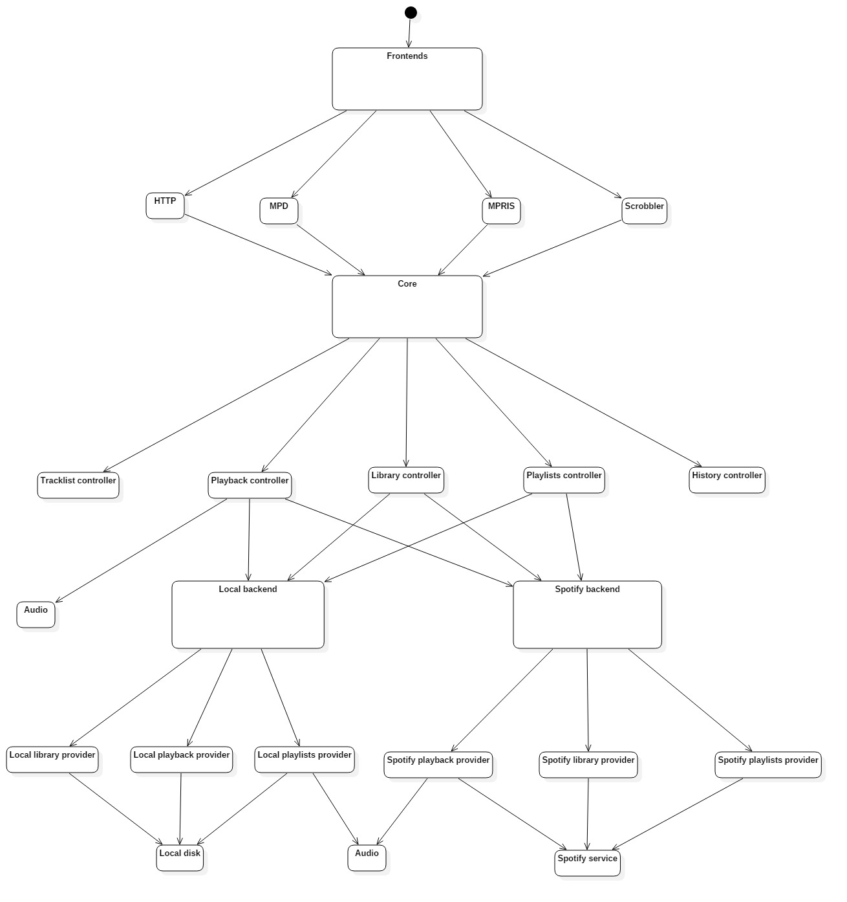

# Mopidy Software Architecture

## Table of contents
- [Mopidy Software Architecture](#mopidy-software-architecture)
    - [Introduction](#introduction)
    - [The 4 + 1 architectural view model](#the-4--1-architectural-view-model)
        - [Logical view](#logical-view)
        - [Implementation view](#implementation-view)
        - [Deployment view](#deployment-view)
        - [Process view](#process-view)

## Introduction

Software architecture is the process of defining a structured solution that meets all of the technical and operational requirements of a software system.
It is usually represented using a set of views or perspectives in which the system's components are shown as well as its relationships to each other and the environment.

We will use the **4 + 1 view model** to describe Mopidy's architecture.

## The 4 + 1 architectural view model

+ **Logical view** : The logical view shows the key abstractions in the system as object classes or their packages.
+ **Implementation view** : The implementation view shows how the software is decomposed (into components) for development.
+ **Deployment view** : The deployment view describes how the system hardware and software components are distributed.
+ **Process view** : The process view shows how the system is composed of interacting processes.

### Logical view

**NOTE:** Due to the lack of knowledge of Python from the group there was a bit of a struggle trying to understand the inner workings of the code in the project.
Even so, we think this representation of packages should be somewhat correct based on how the project is organized in folders.

### Implementation view

The overall architecture of Mopidy is organized around multiple frontends and backends.
The frontends use the core interface and the core component, using the backend's interface, makes multiple backends work as one.
It also makes use of the mixer interface in order to control volume, while the backends use the audio interface in order to play the actual audio.

The **frontends** expose Mopidy to the external world. They can implement servers for protocols like HTTP, MPD and MPRIS, and they can be used to update other services when something happens in Mopidy, like the Last.fm scrobbler frontend does.

The **core** is the single component that the frontends send their requests to. For every request from a frontend it calls out to one or more backends which does the real work, and when the backends respond, the core component is responsible for combining the responses into a single response to the requesting frontend.

The **backends** are organized as a set of providers with responsiblity for separate sets of functionality, similar to the core component.
Anything specific to i.e. Spotify integration or local storage is contained in the backends. To integrate with new music sources, a new backend just needs to be added.

The **audio** component is a thin wrapper around the parts of the GStreamer library, most backends can use the default playback provider without any changes.

The **mixer** component is responsible for volume control and muting. The default mixer uses the audio component to control volume in software.

### Deployment view

Since Mopidy in itself is just a server it doesn't have many requirements in order to run (Unix based system with internet connection, Python 2.7 or higher and GStreamer if sound playback is desired).
Although, if more functionality is needed, a couple more steps have to be taken.

For starters there needs to be a server machine where Mopidy runs, which can be extended in functionality by using the various backends for music services (Spotify, Youtube, Soundcloud, etc).
Next, if having control over the server is desired, some frontends should also be installed, the main ones being the HTTP frontend (for control using a web client/browser) and the MPD frontend which comes bundled with Mopidy already.

All that's left is a user machine: PC, Smartphone, etc. that has a client installed (Web or MPD client) so it can access and control the music server. It is worth noting that **both** the server and client can be the same machine, provided that machine fulfills the requirements previously specified.

### Process view

