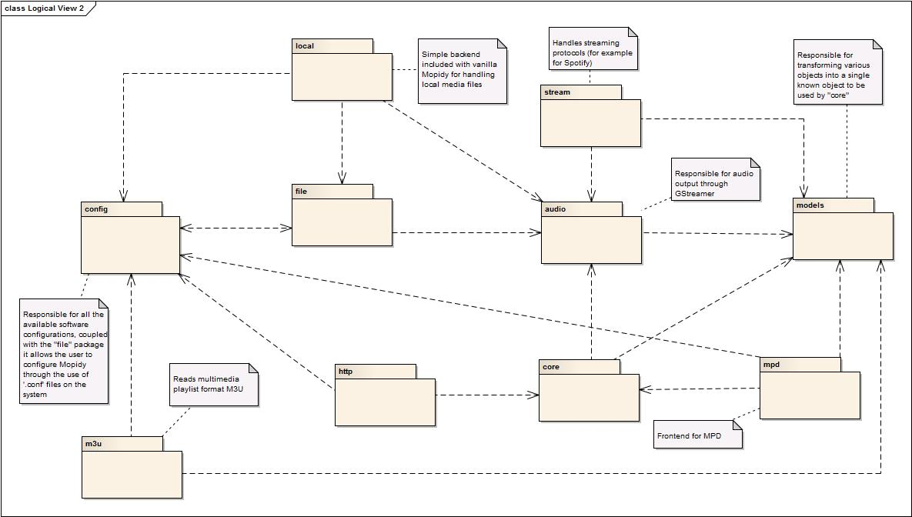
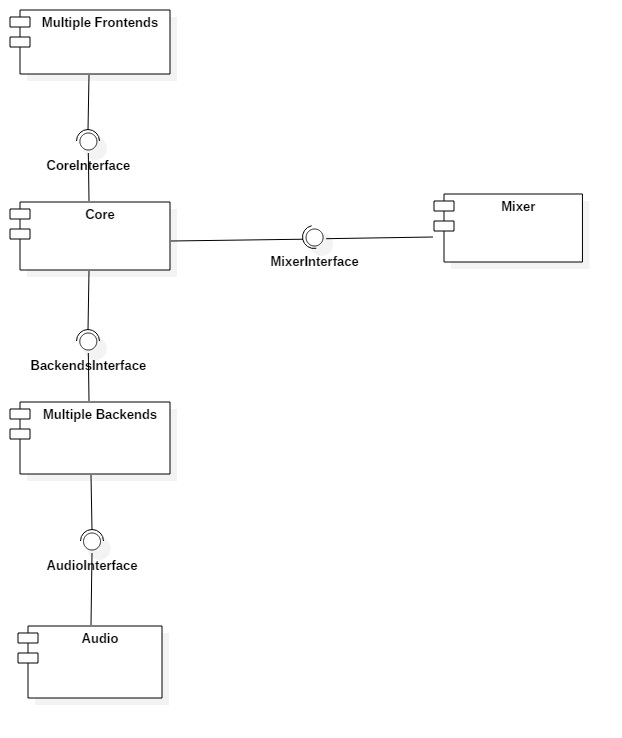

 # Mopidy Software Architecture

## Table of contents
@@TOC@@

## Introduction

Software architecture is the process of defining a structured solution that meets all of the technical and operational requirements of a software system.
It is usually represented using a set of views or perspectives in which the system's components are shown as well as its relationships to each other and the environment.

We will use the **4 + 1 view model** to describe Mopidy's architecture.

## The 4 + 1 architectural view model

+ **Logical view** : The logical view shows the key abstractions in the system as object classes or their packages.
+ **Implementation view** : The implementation view shows how the software is decomposed (into components) for development.
+ **Deployment view** : The deployment view describes how the system hardware and software components are distributed.
+ **Process view** : The process view shows how the system is composed of interacting processes.

### Logical view

**NOTE:** Due to the lack of knowledge of Python from the group there was a bit of a struggle trying to understand the inner workings of the code in the project.
Even so, we think this representation of packages should be somewhat correct based on how the project is organized in folders.

### Implementation view

The overall architecture of Mopidy is organized around multiple frontends and backends. The frontends use the core API. The core actor makes multiple backends work as one. The backends connect to various music sources. The core actor use the mixer actor to control volume, while the backends use the audio actor to play audio.
The core is organized as a set of controllers with responsiblity for separate sets of functionality.

Frontends expose Mopidy to the external world. They can implement servers for protocols like HTTP, MPD and MPRIS, and they can be used to update other services when something happens in Mopidy, like the Last.fm scrobbler frontend does.

The core is the single actor that the frontends send their requests to. For every request from a frontend it calls out to one or more backends which does the real work, and when the backends respond, the core actor is responsible for combining the responses into a single response to the requesting frontend.

The backends are organized as a set of providers with responsiblity for separate sets of functionality, similar to the core actor.
Anything specific to i.e. Spotify integration or local storage is contained in the backends. To integrate with new music sources, you just add a new backend.

The audio actor is a thin wrapper around the parts of the GStreamer library we use. If you implement an advanced backend, you may need to implement your own playback provider using the [mopidy.audio — Audio API](https://docs.mopidy.com/en/latest/api/audio/#audio-api), but most backends can use the default playback provider without any changes.

The mixer actor is responsible for volume control and muting. The default mixer use the audio actor to control volume in software. 

### Deployment view

### Process view

