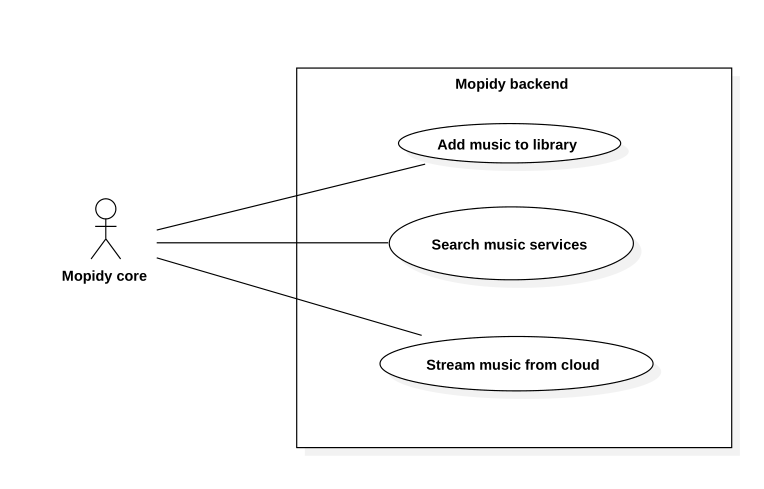

# Mopidy Requirements

## Table of contents
- [Mopidy Requirements](#mopidy-requirements)
    - [Table of contents](#table-of-contents)
    - [Introduction](#introduction)
    - [Requirements](#requirements)
        - [System Requirements](#system-requirements)
        - [Elicitation and Analysis](#elicitation-and-analysis)
        - [Specification](#specification)
        - [Validation](#validation)
        - [Use cases](#use-cases)
            - [Backends](#backends)
            - [Frontends](#frontends)

## Introduction

## Requirements

### System Requirements

Mopidy requires a Unix based system (for example a Linux distribution or a Macintosh) with network connectivity and audio output.

### Elicitation and Analysis

New features can be suggested essentially by everyone, however, the ones that are added are a mix of what the developers feel is most important/requested and other functionality they think is fun to make, even though they may only be useful for a very limited number of users or for specific use cases.

The suggestions and discussions of these features take place in the [issue tracker](https://github.com/mopidy/mopidy/issues) of the Github repository, which later are merged upstream through the use of pull requests.

### Specification

Mopidy itself does not have a SRS (Software Requirements Specification) document, however, there are some other documents available which explain the inner workings of the software:
* [Glossary](https://mopidy.readthedocs.org/en/latest/glossary/)
* [Mopidy Command](https://mopidy.readthedocs.org/en/latest/command/)
* [API Reference](https://mopidy.readthedocs.org/en/latest/api/)
* [Module Reference](https://mopidy.readthedocs.org/en/latest/modules/)

### Validation

### Use cases

Since Mopidy is just a music server in itself that plays music from local disk, it needs to be extended in order to be controlled or play music from other sources. This is done through the use of extensions.

Extensions can be of two types: a **backend** or **frontend**.
Both are installed seperately on top of Mopidy and they can extend the server's functionality in various ways.

In order for backends and frontends to communicate with each other Mopidy provides an API called `mopidy.core` which basically [makes multiple frontends capable of using multiple backends](https://mopidy.readthedocs.org/en/latest/glossary/#term-core).

#### Backends

The main purpose of a backend is to provide Mopidy of more sources of music, increasing its library size.

One of the backends that comes installed with vanilla Mopidy is [Mopidy-Local](https://mopidy.readthedocs.org/en/latest/ext/local/) which is responsible for getting music files from the local disk.
However, backends for online music services can be easily added, provided they have a public API available.
Some of the existing backends are:
[Mopidy-Spotify](https://github.com/mopidy/mopidy-spotify),
[Mopidy-SoundCloud](https://github.com/mopidy/mopidy-soundcloud),
[Mopidy-YouTube](https://github.com/dz0ny/mopidy-youtube), etc.

#### Frontends

Frontends on the other hand are what make it possible to control the server itself using the `mopidy.core` API which provides enough functionality to create for example (but not limited to) music players.
Frontends can also be web based, making it possible to control Mopidy remotely ([Android clients](http://mopidy.readthedocs.org/en/latest/clients/mpd/#mpd-android-clients), [Web clients](http://mopidy.readthedocs.org/en/latest/clients/mpd/#mpd-web-clients)).

