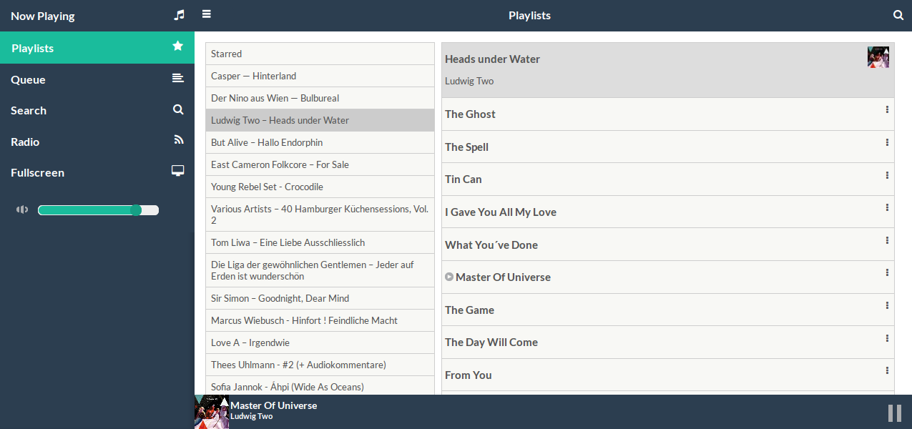

.. _http-clients:

************
HTTP clients
************

Mopidy added an :ref:`HTTP frontend <ext-http>` and an :ref:`HTTP API
<http-api>` in 0.10 which together provides the building blocks needed for
creating web clients for Mopidy with the help of a WebSocket and a JavaScript
library provided by Mopidy.

This page will list any Mopidy web clients using the HTTP frontend. If you've
created one, please notify us so we can include your client on this page.

See :ref:`http-api` for details on how to build your own web client.

Mopidy MusicBox Webclient
=========================

The first web client for Mopidy, made with jQuery Mobile by Wouter van Wijk.
Also the web client used for Wouter's popular `Pi Musicbox
<http://www.pimusicbox.com/>`_ image for Raspberry Pi.

    With Mopidy MusicBox Webclient, you can play your music on your computer
    (Raspberry Pi) and remotely control it from a computer, phone, tablet,
    laptop. From your couch.

    This is a responsive HTML/JS/CSS client especially written for Mopidy, a
    music server. Responsive, so it works on desktop and mobile browsers. You
    can browse, search and play albums, artists, playlists, and it has cover
    art from Last.fm.

    -- https://github.com/woutervanwijk/Mopidy-MusicBox-Webclient

.. include:: /ext/moped.rst

JukePi
======

A Mopidy web client made with Backbone.js by Meantime IT in the UK for their
office jukebox.

    JukePi is a web client for the Mopidy music server. Mopidy empowers you to
    create a custom music server that can connect to Spotify, play local mp3s
    and more.

    -- https://github.com/meantimeit/jukepi

Apollo Player
=============

A Mopidy web client made by Argonaut in SF for their office jukebox.

    Mopidy frontend community driven playlist. Driven by Node.js, Backbone.js,
    and Require.js.

-- https://github.com/samcreate/Apollo-Player

    We've released ARGONAUT's first open source playlist app, APOLLO. It uses
    Mopidy (and the Mopidy Spotify plugin) to create a social listening
    experience for your home or office.

    Users authenticate via Twitter, then search the Spotify library and add
    tracks to the playlist, which plays on the local machine (via Node.js
    server). When the playlist runs out, it switches to a default playlist that
    you define.

    Users can also bomb a track---if it receives 3 down votes, it plays a
    Spotify track to announce the bomb (we use "children booing")---then skips
    to the next track.

-- http://blog.argonautinc.com/post/83027259908/music-is-pretty-important-to-our-culture-and

Mopify
======

An in-development web client that clones the Spotify user interface on top of
Mopidy and the Spotify web APIs.

    A Mopidy web client based on the Spotify webbased interface. If you use
    Mopidy in combination with local music this client probably won't work.
    This client uses the Spotify and EchoNest API to speed up searching and
    artist/album lookup.

    -- https://github.com/dirkgroenen/Mopify

Other web clients
=================

For Mopidy web clients using Mopidy's MPD frontend instead of HTTP, see
:ref:`mpd-web-clients`.
