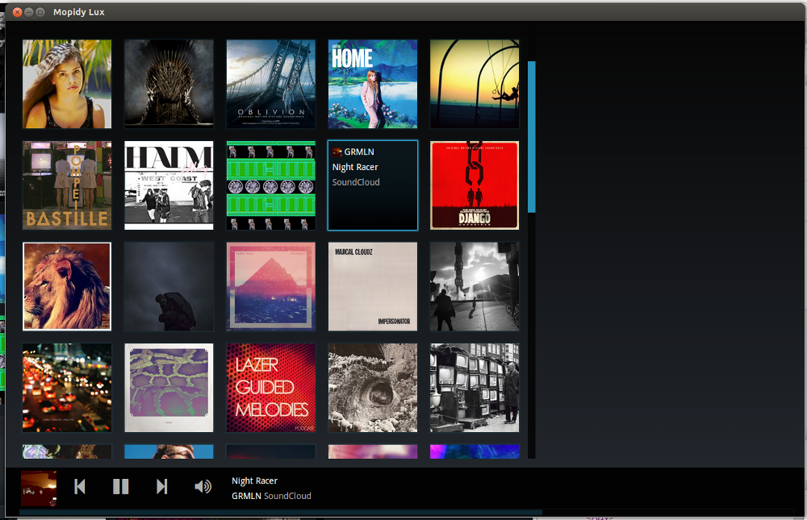

.. _http-clients:

************
HTTP clients
************

Mopidy added an :ref:`HTTP frontend <ext-http>` and an :ref:`HTTP API
<http-api>` in 0.10 which together provides the building blocks needed for
creating web clients for Mopidy with the help of a WebSocket and a JavaScript
library provided by Mopidy.

This page will list any Mopidy web clients using the HTTP frontend. If you've
created one, please notify us so we can include your client on this page.

See :ref:`http-api` for details on how to build your own web client.

woutervanwijk/Mopidy-Webclient
==============================

.. image:: woutervanwijk-mopidy-webclient.png
    :width: 1275
    :height: 600

The first web client for Mopidy, made with jQuery Mobile by Wouter van Wijk.
Also the web client used for Wouter's popular `Pi Musicbox
<http://www.woutervanwijk.nl/pimusicbox/>`_ image for Raspberry Pi.

    With Mopidy Browser Client, you can play your music on your computer (or
    Rapsberry Pi) and remotely control it from a computer, phone, tablet,
    laptop. From your couch.

    -- https://github.com/woutervanwijk/Mopidy-WebClient

Mopidy Lux
==========

A Mopidy web client made with AngularJS by Janez Troha.

    A shiny new remote web control interface for Mopidy player.

    -- https://github.com/dz0ny/mopidy-lux

Moped
=====

A Mopidy web client made with Durandal and KnockoutJS by Martijn Boland.

    Moped is a responsive web client for the Mopidy music server. It is
    inspired by Mopidy-Webclient, but built from scratch based on a different
    technology stack with Durandal and Bootstrap 3.

    -- https://github.com/martijnboland/moped

JukePi
======

A Mopidy web client made with Backbone.js by Meantime IT in the UK for their
office jukebox.

    JukePi is a web client for the Mopidy music server. Mopidy empowers you to
    create a custom music server that can connect to Spotify, play local mp3s
    and more.

    -- https://github.com/meantimeit/jukepi

Other web clients
=================

For Mopidy web clients using Mopidy's MPD frontend instead of HTTP, see
:ref:`mpd-web-clients`.
