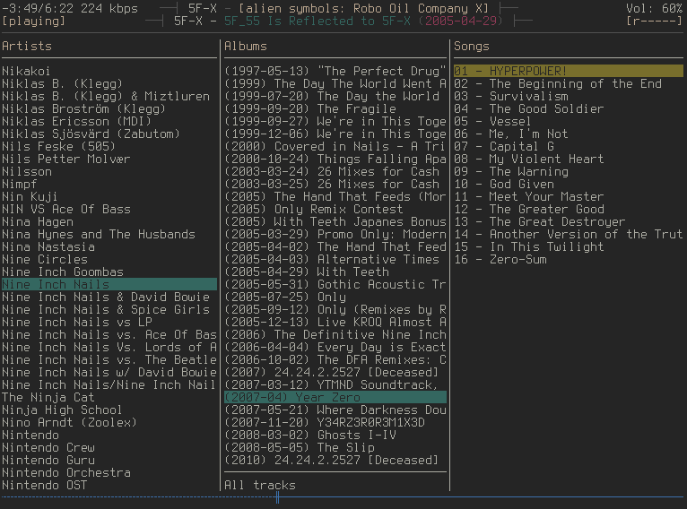
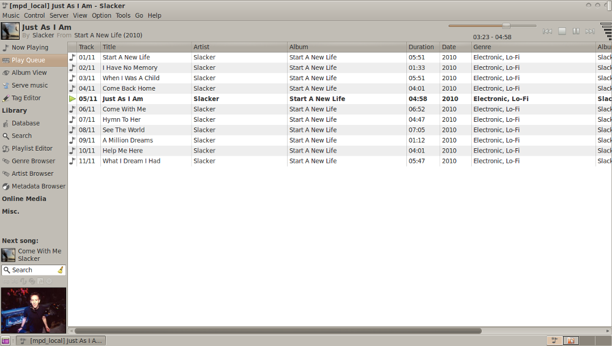
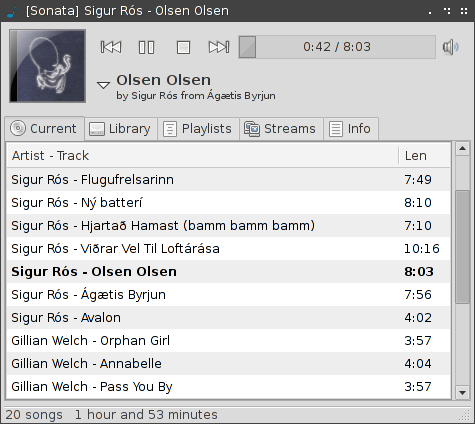
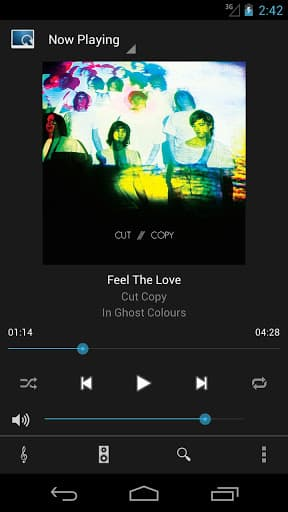
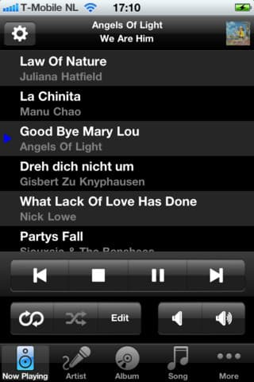
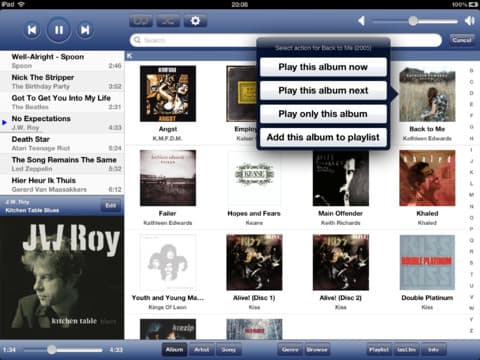
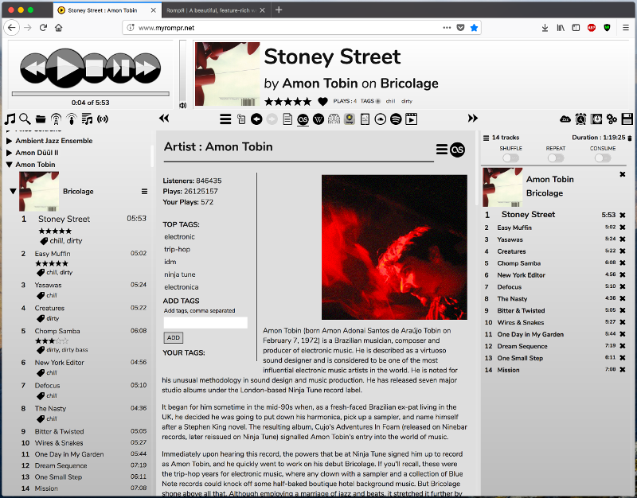

.. _mpd-clients:

***********
MPD clients
***********

This is a list of MPD clients we either know works well with Mopidy, or that we
know won't work well. For a more exhaustive list of MPD clients, see
http://mpd.wikia.com/wiki/Clients.

.. contents:: Contents
    :local:

MPD console clients
===================

ncmpcpp
-------

A console client that works well with Mopidy, and is regularly used by Mopidy
developers.

Search does not work in the "Match if tag contains search phrase (regexes
supported)" mode because the client tries to fetch all known metadata and do
the search on the client side. The two other search modes works nicely, so this
is not a problem.

With ncmpcpp <= 0.5, the library view is very slow when used together with
Mopidy-Spotify. A workaround is to edit the ncmpcpp configuration file
(:file:`~/.ncmpcpp/config`) and set::

    media_library_display_date = "no"

With this change ncmpcpp's library view will still be a bit slow, but usable.

Note that this option was removed in ncmpcpp 0.6, but with this version, the
library view works well without it.

ncmpc
-----

A console client. Works with Mopidy 0.6 and upwards. Uses the ``idle`` MPD
command, but in a resource inefficient way.

mpc
---

A command line client. Version 0.16 and upwards seems to work nicely with
Mopidy.

MPD graphical clients
=====================

GMPC
----

`GMPC <http://gmpc.wikia.com/wiki/Gnome_Music_Player_Client>`_ is a graphical MPD client (GTK+) which works
well with Mopidy.

GMPC may sometimes requests a lot of meta data of related albums, artists, etc.
This takes more time with Mopidy, which needs to query Spotify for the data,
than with a normal MPD server, which has a local cache of meta data. Thus, GMPC
may sometimes feel frozen, but usually you just need to give it a bit of slack
before it will catch up.

Sonata
------

`Sonata <https://github.com/multani/sonata>`_ is a graphical MPD client (GTK+).
It generally works well with Mopidy, except for search.

When you search in Sonata, it only sends the first to letters of the search
query to Mopidy, and then does the rest of the filtering itself on the client
side. Since Spotify has a collection of millions of tracks and they only return
the first 100 hits for any search query, searching for two-letter combinations
seldom returns any useful results. See :issue:`1` for details.

Theremin
--------

`Theremin <https://github.com/pweiskircher/Theremin>`_ is a graphical MPD
client for OS X. It is unmaintained, but generally works well with Mopidy.

.. _android_mpd_clients:

MPD Android clients
===================

MPDroid
-------

You can get `MPDroid from Google Play
<https://play.google.com/store/apps/details?id=com.namelessdev.mpdroid>`_.

MPDroid is a good MPD client, and really the only one we can recommend.

.. _ios_mpd_clients:

MPD iOS clients
===============

MPoD
----

The `MPoD <http://www.katoemba.net/makesnosenseatall/mpod/>`_ iPhone/iPod Touch
app can be installed from `MPoD at iTunes Store
<https://itunes.apple.com/us/app/mpod/id285063020>`_.

MPaD
----

The `MPaD <http://www.katoemba.net/makesnosenseatall/mpad/>`_ iPad app can be
purchased from `MPaD at iTunes Store
<https://itunes.apple.com/us/app/mpad/id423097706>`_

.. _mpd-web-clients:

MPD web clients
===============

The following web clients use the MPD protocol to communicate with Mopidy. For
other web clients, see :ref:`http-clients`.

Rompr
-----

`Rompr <http://sourceforge.net/projects/rompr/>`_ is a web based MPD client.
`mrvanes <https://github.com/mrvanes>`_, a Mopidy and Rompr user, said: "These
projects are a real match made in heaven."

Partify
-------

`Partify <https://github.com/fhats/partify>`_ is a web based MPD client
focussing on making music playing collaborative and social.
