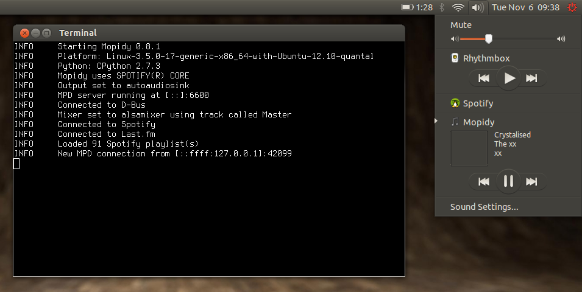

.. _mpris-clients:

*************
MPRIS clients
*************

`MPRIS <http://specifications.freedesktop.org/mpris-spec/latest/>`_ is short for Media Player Remote Interfacing
Specification. It's a spec that describes a standard D-Bus interface for making
media players available to other applications on the same system.

The MPRIS frontend provided by the `Mopidy-MPRIS extension
<https://github.com/mopidy/mopidy-mpris>`_ currently implements all required
parts of the MPRIS spec, plus the optional playlist interface. It does not
implement the optional tracklist interface.

.. _ubuntu-sound-menu:

Ubuntu Sound Menu
=================

The `Ubuntu Sound Menu <https://wiki.ubuntu.com/Sound#menu>`_ is the default
sound menu in Ubuntu since 10.10 or 11.04. By default, it only includes the
Rhytmbox music player, but many other players can integrate with the sound
menu, including the official Spotify player and Mopidy.

If you install Mopidy from apt.mopidy.com, the sound menu should work out of
the box. If you install Mopidy in any other way, you need to make sure that the
file located at ``extra/desktop/mopidy.desktop`` in the Mopidy git repo is
installed as ``/usr/share/applications/mopidy.desktop``, and that the
properties ``TryExec`` and ``Exec`` in the file points to an existing
executable file, preferably your Mopidy executable. If this isn't in place, the
sound menu will not detect that Mopidy is running.

Next, Mopidy's MPRIS frontend must be running for the sound menu to be able to
control Mopidy. The frontend is enabled by default, so as long as you have all
its dependencies available, you should be good to go. Keep an eye out for
warnings or errors from the MPRIS frontend when you start Mopidy, since it may
fail because of missing dependencies or because Mopidy is started outside of X;
the frontend won't work if ``$DISPLAY`` isn't set when Mopidy is started.

Under normal use, if Mopidy isn't running and you open the menu and click on
"Mopidy Music Server", a terminal window will open and automatically start
Mopidy. If Mopidy is already running, you'll see that Mopidy is marked with an
arrow to the left of its name, like in the screen shot above, and the player
controls will be visible. Mopidy doesn't support the MPRIS spec's optional
playlist interface yet, so you'll not be able to select what track to play from
the sound menu. If you use an MPD client to queue a playlist, you can use the
sound menu to check what you're currently playing, pause, resume, and skip to
the next and previous track.

In summary, Mopidy's sound menu integration is currently not a full featured
client, but it's a convenient addition to an MPD client since it's always
easily available on Unity's menu bar.

Rygel
=====

Rygel is an application that will translate between Mopidy's MPRIS interface
and UPnP, and thus make Mopidy controllable from devices compatible with UPnP
and/or DLNA. To read more about this, see :ref:`upnp-clients`.
