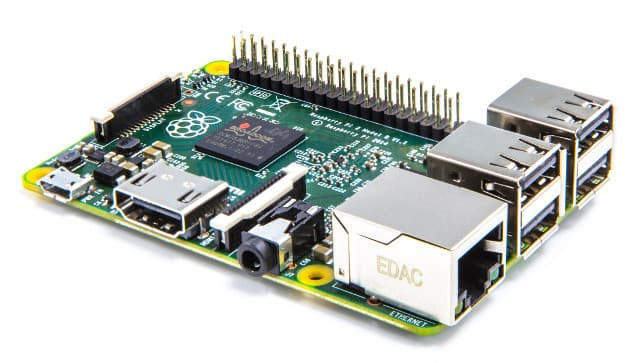

.. _raspberrypi-installation:

************
Raspberry Pi
************

Mopidy runs on all versions of `Raspberry Pi <https://www.raspberrypi.org/>`_.
However, note that Raspberry Pi 2 B's CPU is approximately six times as
powerful as Raspberry Pi 1 and Raspberry Pi Zero, so Mopidy will be more joyful
to use on a Raspberry Pi 2.

How to for Raspbian Jessie
==========================

#. Download the latest Jessie or Jessie Lite disk image from
   http://www.raspberrypi.org/downloads/raspbian/.

   If you're only using your Pi for Mopidy, go with Jessie Lite as you won't
   need the full graphical desktop included in the Jessie image.

#. Flash the Raspbian image you downloaded to your SD card.

   See the `Raspberry Pi installation docs
   <https://www.raspberrypi.org/documentation/installation/installing-images/README.md>`_
   for instructions.

#. If you connect a monitor and a keyboard, you'll see that the Pi boots right
   into the ``raspi-config`` tool.

   If you boot with only a network cable connected, you'll have to find the IP
   address of the Pi yourself, e.g. by looking in the client list on your
   router/DHCP server. When you have found the Pi's IP address, you can SSH to
   the IP address and login with the user ``pi`` and password ``raspberry``.
   Once logged in, run ``sudo raspi-config`` to start the config tool as the
   ``root`` user.

#. Use the ``raspi-config`` tool to setup the basics of your Pi. You might want
   to do one or more of the following:

   - Expand the file system to fill the SD card.
   - Change the password of the ``pi`` user.
   - Change the time zone.

   Under "Advanced Options":

   - Set a hostname.
   - Enable SSH if not already enabled.
   - If your will use HDMI for display and 3.5mm jack for audio, force the
     audio output to the 3.5mm jack. By default it will use HDMI for audio
     output if an HDMI cable is connected and the 3.5mm jack if not.

   Once done, select "Finish" and restart your Pi.

   If you want to change any settings later, you can simply rerun ``sudo
   raspi-config``.

#. Once you've rebooted and has logged in as the ``pi`` user, you can enter
   ``sudo -i`` to become ``root``.

#. Install Mopidy and its dependencies as described in :ref:`debian-install`.

#. Finally, you need to set a couple of :doc:`config values </config>`, and
   then you're ready to :doc:`run Mopidy </running>`. Alternatively you may
   want to have Mopidy run as a :ref:`system service <service>`, automatically
   starting at boot.

Testing sound output
====================

You can test sound output independent of Mopidy by running::

    aplay /usr/share/sounds/alsa/Front_Center.wav

If you hear a voice saying "Front Center", then your sound is working.

If you want to change your audio output setting, simply rerun ``sudo
raspi-config``. Alternatively, you can change the audio output setting
directly by running:

- Auto (HDMI if connected, else 3.5mm jack): ``sudo amixer cset numid=3 0``
- Use 3.5mm jack: ``sudo amixer cset numid=3 1``
- Use HDMI: ``sudo amixer cset numid=3 2``
