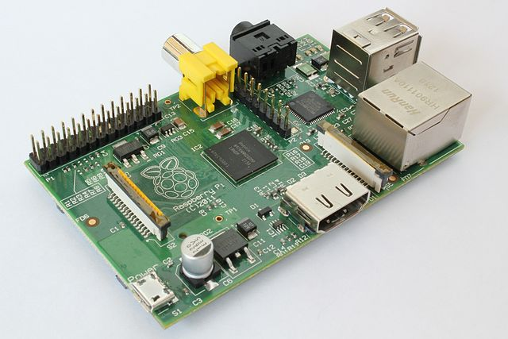

.. _raspberrypi-installation:

****************************
Installation on Raspberry Pi
****************************

Mopidy runs nicely on a `Raspberry Pi <http://www.raspberrypi.org/>`_. As of
January 2013, Mopidy will run with Spotify support on both the armel
(soft-float) and armhf (hard-float) architectures, which includes the Raspbian
distribution.

.. _raspi-wheezy:

How to for Raspbian "wheezy" and Debian "wheezy"
================================================

This guide applies for both:

- Raspian "wheezy" for armhf (hard-float), and
- Debian "wheezy" for armel (soft-float)

If you don't know which one to select, go for the armhf variant, as it'll give
you a lot better performance.

#. Download the latest "wheezy" disk image from
   http://www.raspberrypi.org/downloads/. This was last tested with the images
   from 2013-05-25 for armhf and 2013-05-29 for armel.

#. Flash the OS image to your SD card. See
   http://elinux.org/RPi_Easy_SD_Card_Setup for help.

#. If you have an SD card that's >2 GB, you don't have to resize the file
   systems on another computer. Just boot up your Raspberry Pi with the
   unaltered partions, and it will boot right into the ``raspi-config`` tool,
   which will let you grow the root file system to fill the SD card. This tool
   will also allow you do other useful stuff, like turning on the SSH server.

#. You can login to the default user using username ``pi`` and password
   ``raspberry``. To become root, just enter ``sudo -i``.

#. To avoid a couple of potential problems with Mopidy, turn on IPv6 support:

   - Load the IPv6 kernel module now::

         sudo modprobe ipv6

   - Add ``ipv6`` to ``/etc/modules`` to ensure the IPv6 kernel module is
     loaded on boot::

         echo ipv6 | sudo tee -a /etc/modules

#. Since I have a HDMI cable connected, but want the sound on the analog sound
   connector, I have to run::

       sudo amixer cset numid=3 1

   to force it to use analog output. ``1`` means analog, ``0`` means auto, and
   is the default, while ``2`` means HDMI. You can test sound output
   independent of Mopidy by running::

       aplay /usr/share/sounds/alsa/Front_Center.wav

   If you hear a voice saying "Front Center", then your sound is working.

   To make the change to analog output stick, you can add the ``amixer``
   command to e.g. ``/etc/rc.local``, which will be executed when the system is
   booting.

#. Install Mopidy and its dependencies from `apt.mopidy.com
   <http://apt.mopidy.com/>`_, as described in :ref:`installation`.

#. Finally, you need to set a couple of :doc:`config values </config>`, and
   then you're ready to :doc:`run Mopidy </running>`.

Appendix: Fixing audio quality issues
=====================================

As of about April 2013 the following steps should resolve any audio
issues for HDMI and analog without the use of an external USB sound
card.

#. Ensure your system is up to date. On Debian based systems run::

      sudo apt-get update
      sudo apt-get dist-upgrade

#. Ensure you have a new enough firmware. On Debian based systems
   `rpi-update <https://github.com/Hexxeh/rpi-update>`_
   can be used.

#. Update either ``~/.asoundrc`` or ``/etc/asound.conf`` to the
   following::

       pcm.!default {
               type hw
               card 0
       }
       ctl.!default {
               type hw
               card 0
       }

   Note that if you have an ``~/.asoundrc`` it will overide any global
   settings from ``/etc/asound.conf``.

#. Update your ``~/.config/mopidy/mopidy.conf`` to contain::

       [audio]
       output = alsasink

   This is to tell GStreamer not to pick Jack which it seems to like picking on
   Raspberry Pis for some reason.

Following these steps you should be able to get crackle free sound on either
HDMI or analog. Note that you might need to ensure that PulseAudio is no longer
running to get this working nicely.

This recipe has been confirmed as working by a number of users on our issue
tracker and IRC. As a reference, the following versions where used for testing
this, however all newer and some older version are likely to work as we have
not determined the exact revision that fixed this::

    $ uname -a
    Linux raspberrypi 3.6.11+ #408 PREEMPT Wed Apr 10 20:33:39 BST 2013 armv6l GNU/Linux

    $ /opt/vc/bin/vcgencmd version
    Apr 25 2013 01:07:36
    Copyright (c) 2012 Broadcom
    version 386589 (release)

The only remaining known issue is a slight gap in playback at track changes
this is likely due to gapless playback not being implemented and is being
worked on irrespective of Raspberry Pi related work.
