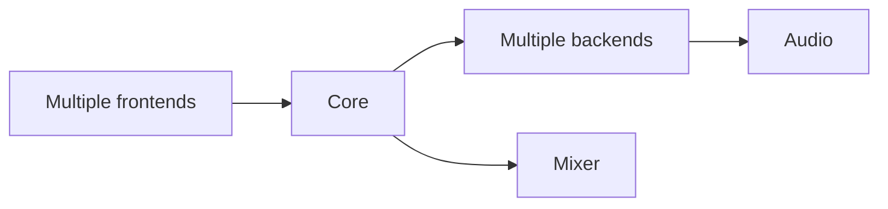
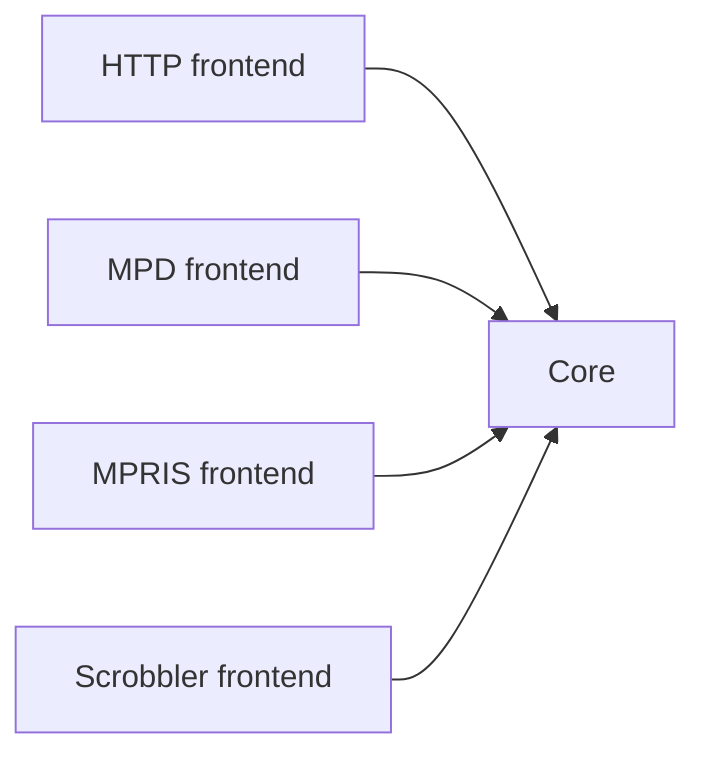
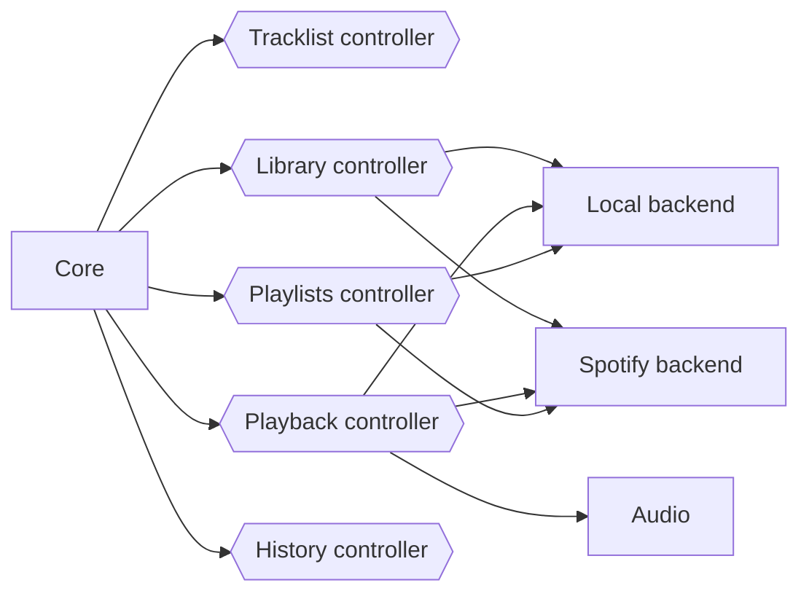
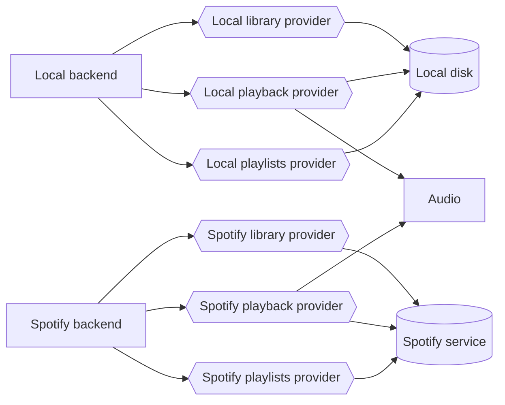

# Architecture

The overall architecture of Mopidy is organized around multiple frontends and
backends. The frontends use the core API. The core actor makes multiple backends
work as one. The backends connect to various music sources. The core actor use
the mixer actor to control volume, while the backends use the audio actor to
play audio.

## Frontends

Frontends expose Mopidy to the external world. They can implement servers for
protocols like HTTP, MPD and MPRIS, and they can be used to update other
services when something happens in Mopidy, like the Last.fm scrobbler frontend
does. See [Frontend API](frontend.md) for more details.

## Core

The core is organized as a set of controllers with responsibility for separate
sets of functionality.

The core is the single actor that the frontends send their requests to. For
every request from a frontend it calls out to one or more backends which does
the real work, and when the backends respond, the core actor is responsible for
combining the responses into a single response to the requesting frontend.

The core actor also keeps track of the tracklist, since it doesn't belong to a
specific backend.

See [Core API](core.md) for more details.

## Backends

The backends are organized as a set of providers with responsibility for
separate sets of functionality, similar to the core actor.

Anything specific to i.e. Spotify integration or local storage is contained in
the backends. To integrate with new music sources, you just add a new backend.
See [Backend API](backend.md) for more details.

## Audio

The audio actor is a thin wrapper around the parts of the GStreamer library we
use. If you implement an advanced backend, you may need to implement your own
playback provider using the [Audio API](audio.md), but most backends can use the
default playback provider without any changes.

## Mixer

The mixer actor is responsible for volume control and muting. The default mixer
use the audio actor to control volume in software. The alternative
implementations are typically independent of the audio actor, but instead use
some third party Python library or a serial interface to control other forms of
volume controls.
