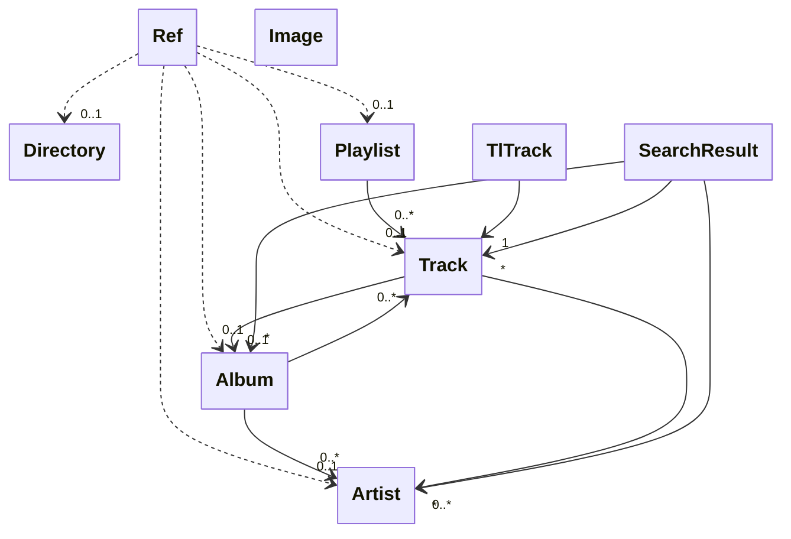

# Data models

These immutable data models are used for all data transfer inbetween the
backend, core, and frontend layers, as described in the
[architecture](architecture.md).

## Relationships



## Immutability

All fields are type checked and immutable. In
other words, they can only be set through the class constructor during instance
creation.

If you want to modify a model, use the `#!python model.replace()` method to
create a copy of the model with the desired modifications. It accepts keyword
arguments for the parts of the model you want to change, and copies the rest of
the data from the model you call it on. Example:

```pycon hl_lines="8"
>>> from mopidy.models import Track
>>> track1 = Track(uri='an-uri', name='Christmas Carol', length=171)
>>> track1
Track(uri='an-uri', name='Christmas Carol', artists=frozenset(), album=None,
composers=frozenset(), performers=frozenset(), genre=None, track_no=None,
disc_no=None, date=None, length=171, bitrate=None, comment=None,
musicbrainz_id=None, last_modified=None)
>>> track2 = track1.replace(length=37)
>>> track2
Track(uri='an-uri', name='Christmas Carol', artists=frozenset(), album=None,
composers=frozenset(), performers=frozenset(), genre=None, track_no=None,
disc_no=None, date=None, length=37, bitrate=None, comment=None,
musicbrainz_id=None, last_modified=None)
```

::: mopidy.models
    options:
      heading_level: 2
